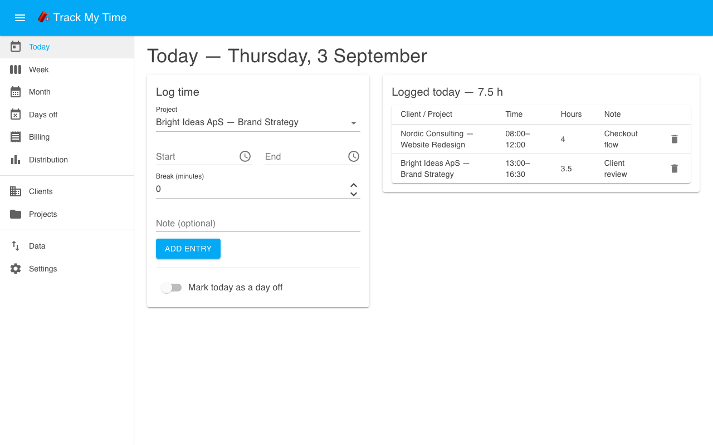
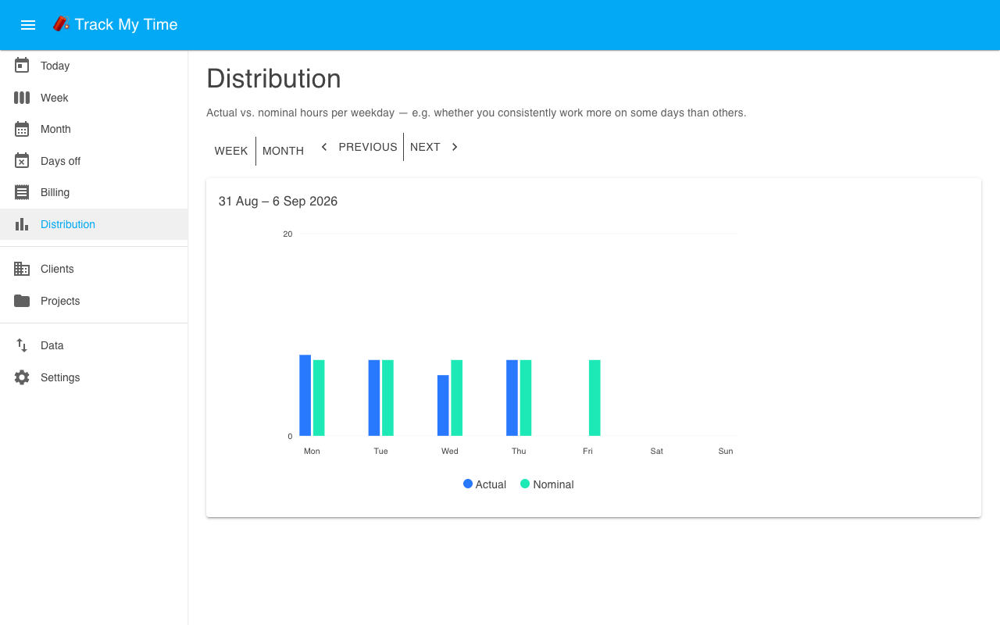

# Track My Time (TMT)

Time tracking for consultants, built to run as a Home Assistant app (add-on) - track hours per
day, client, and project; compare actual hours against your nominal weekly hours by week and by
month; and see the key figures on your own HA dashboards.

See [`track-my-time/DOCS.md`](track-my-time/DOCS.md) for what the app does and how to use it.
The rest of this file is about developing it.

## Screenshots

| | |
|---|---|
|  |  |

More screenshots in [`track-my-time/DOCS.md`](track-my-time/DOCS.md#screenshots).

## Repository layout

- `track-my-time/` - the Home Assistant app: `config.yaml`, `Dockerfile`, docs, icon/logo,
  `screenshots/`, and the `app/` subfolder containing the actual .NET solution
  (`app/src/TrackMyTime.Web`, the Blazor Server app; `app/src/TrackMyTime.Tests`, its test suite).
  The app's own source has to live inside the app folder because Docker's build context can't
  reach outside it.
- `repository.yaml` - marks this repo as a Home Assistant apps repository.
- `.devcontainer.json` / `.vscode/tasks.json` - the local dev environment below.

## Local development

### Fast inner loop: `dotnet run`

For UI/data logic changes, run the app directly against a local SQLite file - no Home Assistant
needed:

```sh
cd track-my-time/app/src/TrackMyTime.Web
dotnet run
```

Run the tests with `dotnet test track-my-time/app/TrackMyTime.slnx` (or from within
`track-my-time/app`).

### Full loop: Supervisor dev container

Ingress path handling, MQTT discovery, and backups can only really be verified against a real
Supervisor + Home Assistant instance. This repo is set up for Home Assistant's official
dev container, which gives you exactly that with no physical hardware:

**Prerequisites:** VS Code, Docker (or Podman with its Docker-compatible socket), the Dev
Containers extension.

1. Open this folder in VS Code, then **Rebuild and Reopen in Container** when prompted.
2. Run the **Start Home Assistant** task (Terminal → Run Task) - it bootstraps Supervisor and
   Home Assistant inside the container.
3. Open <http://localhost:7123/> and complete onboarding. Because `track-my-time/` sits at the
   repo root, it shows up automatically under **Settings → Add-ons → Local add-ons** (also
   labelled "Local apps" in newer Home Assistant versions) - install it there.
4. Iterate: edit code, then run the **Rebuild and Start App** task (pick `track-my-time` when
   prompted) to rebuild the container from the Dockerfile and tail its logs. This is also how
   you force a local Dockerfile build even after `config.yaml` has a published `image:` set.
5. For MQTT testing, also install the Mosquitto broker app inside the dev container.

Reserve an install on a real HA Blue for a final performance/footprint check before calling a
change done - the dev container won't reflect the SoC's real ARM64 performance.

### Building the container image directly

Outside the dev container, you can build (and, with Podman, run) the image directly:

```sh
cd track-my-time
podman build -t track-my-time:local .
```

## Releasing

`track-my-time/config.yaml` has no `image:` field by default, so Supervisor always builds the
app from the `Dockerfile` locally - this is what you want during development, since once
`image:` IS set, Supervisor always tries to *pull* that tag and does **not** fall back to a
local build if the pull fails.

To switch to prebuilt images once you're happy with a release:

1. Bump `version` in `track-my-time/config.yaml` (and add a `CHANGELOG.md` entry).
2. Push a matching `vX.Y.Z` git tag - `.github/workflows/build.yml` builds and pushes a
   multi-arch image to GHCR.
3. In GitHub, make the resulting `ghcr.io/<owner>/timetracker/track-my-time` package public
   (Packages tab → package settings → Change visibility) - Supervisor pulls anonymously, so a
   private package 403s.
4. Add `image: ghcr.io/<owner>/timetracker/track-my-time` back to `config.yaml` and push.
