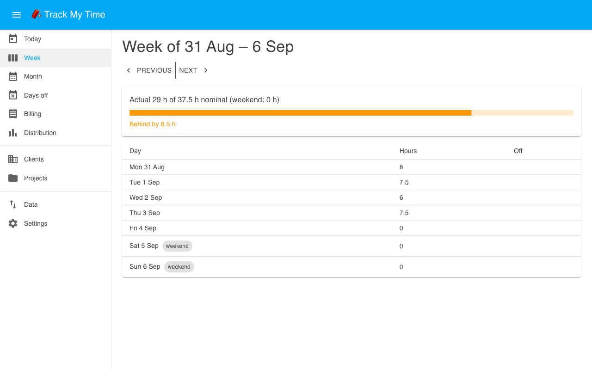
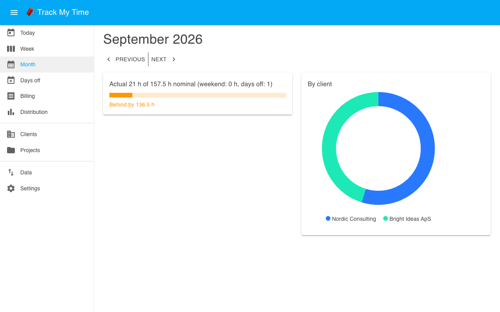
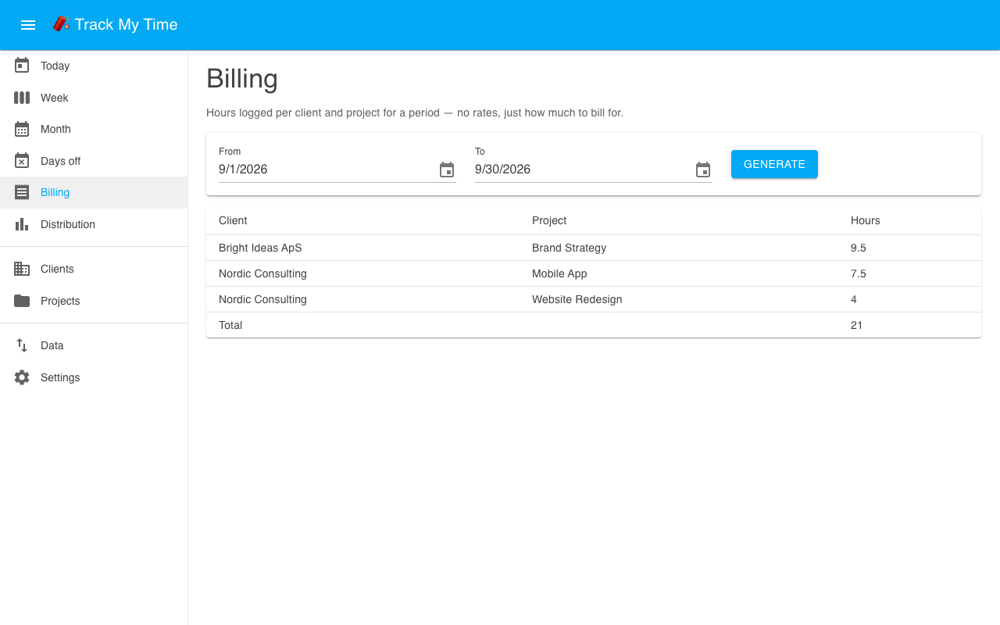
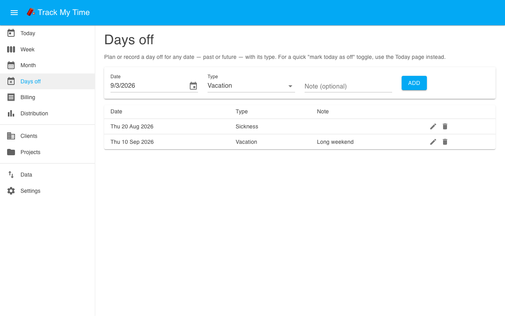

# Track My Time (TMT)

Track consultancy hours per client and project, and compare your actual hours against your
nominal (contracted) weekly hours - by week and by month.

## Features

- Log time per day against a client/project. Weekend entries are allowed and count as actual
  hours, but never count toward the nominal target.
- Mark a day off (vacation, sick, etc.) to subtract that day's share of your nominal hours from
  the week/month target.
- Nominal weekly hours are a dated setting, not a single fixed number - add a new value when
  your contracted hours change and past weeks/months still compare against the rate that
  applied at the time.
- Actual-vs-nominal figures are published to Home Assistant via MQTT Discovery (if a broker is
  configured), so you can put them on your own dashboards as ordinary sensors.

## Setup

1. Install the app.
2. (Optional, for dashboard entities) Have an MQTT broker configured in Home Assistant, e.g. the
   Mosquitto broker app. Track My Time discovers it automatically via `services: [mqtt:want]` -
   there's nothing to configure here.
3. Start the app and open it from the sidebar.
4. In **Settings**, add your nominal weekly hours (e.g. 37.5), effective from today (or an
   earlier date if you want past weeks/months compared against it too).
5. Add a client and a project under **Clients** / **Projects**, then start logging time on the
   **Today** page.

## Screenshots

| | |
|---|---|
|  Logging time via from/to pickers |  Week view, actual vs. nominal |
|  Month view, hours by client |  Billing: hours per client/project |
|  Distribution across weekdays |  Days off with type |

## Home Assistant entities

With an MQTT broker available, these sensors appear automatically:

| Entity (object_id)      | Meaning                                    |
|--------------------------|---------------------------------------------|
| `today_actual_hours`     | Hours logged today                          |
| `week_actual_hours`      | Hours logged this week (Mon-Sun), including weekends |
| `week_nominal_hours`     | This week's nominal target                  |
| `week_delta_hours`       | Actual minus nominal (negative = behind)    |
| `month_actual_hours`     | Hours logged this month                     |
| `month_nominal_hours`    | This month's nominal target                 |
| `month_delta_hours`      | Actual minus nominal                        |

### Dashboard card: this week's hours vs. nominal

A simple overview card for a Lovelace dashboard, using the [Mushroom
cards](https://github.com/piitaya/lovelace-mushroom) (install via HACS first). Copy this into a
dashboard's YAML (e.g. add a manual card, then "Edit in YAML"):

```yaml
type: custom:mushroom-template-card
primary: This week
secondary: >-
  {{ states('sensor.tmt_week_actual_hours') }} / {{ states('sensor.tmt_week_nominal_hours') }} h
  ({{ '+' if states('sensor.tmt_week_delta_hours') | float(0) >= 0 else '' }}{{ states('sensor.tmt_week_delta_hours') }} h)
icon: mdi:calendar-week
icon_color: >-
  {{ 'green' if states('sensor.tmt_week_delta_hours') | float(0) >= 0 else 'orange' }}
badge_icon: >-
  {{ 'mdi:arrow-up-bold' if states('sensor.tmt_week_delta_hours') | float(0) >= 0 else 'mdi:arrow-down-bold' }}
badge_color: >-
  {{ 'green' if states('sensor.tmt_week_delta_hours') | float(0) >= 0 else 'orange' }}
tap_action:
  action: more-info
  entity: sensor.tmt_week_actual_hours
```

Renders as e.g. "This week — 6.75 / 37.5 h (+6.75 h)", turning orange when behind nominal. The
entity IDs above are Home Assistant's default slug of each sensor's discovery name (e.g. "TMT
Week Actual Hours" → `sensor.tmt_week_actual_hours`) - check **Developer tools → States** and
adjust if you had same-named entities before installing this app, since HA suffixes those
(`_2`, `_3`, ...) instead of reusing them.

## Data & backups

All data lives in a SQLite database under `/data`, which Supervisor keeps across app
upgrades - it's only lost if the app itself is uninstalled. On top of that:

- Before any database migration runs, a snapshot is written to `/data/backups/`.
- A snapshot is also taken once every 24 hours, with the last 14 kept.
- The app is included in normal Home Assistant backups (`backup: hot`).

## Tracking a second person

Track My Time is intentionally single-user - it doesn't have its own login system, relying
entirely on Home Assistant's own ingress authentication. To track a second person's hours
separately, install a **second instance** of the app rather than sharing one:

- If you're installing from a published image, duplicate this folder in your own copy of the
  repository (e.g. as `track-my-time-2`) with a different `slug` and `name` in `config.yaml`,
  but the same `image:`. No Dockerfile or source needed for the second copy.
- If you're building locally (no image published yet), duplicate the whole folder, including
  the `app/` subfolder.

Supervisor gives each installed slug its own `/data` and ingress panel automatically.

## Local development

See the repository's `README.md` for the Supervisor dev container setup used to test this app
against real Home Assistant ingress, MQTT, and backups without any physical hardware.
